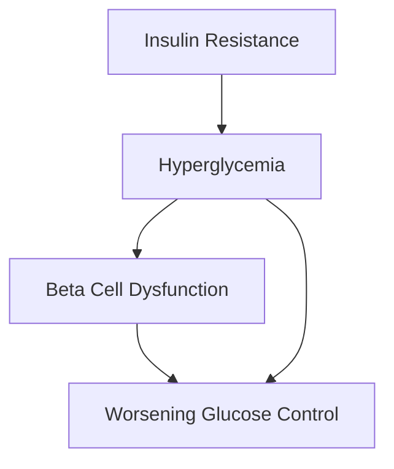

# Mechanism Flowchart

Generates Mermaid flowchart code and visual representations of medical mechanisms, pathophysiology, and drug action pathways.

## Features

- Automatic flowchart generation from text descriptions
- Multiple diagram types (flowchart, sequence, state)
- Customizable styling for publication
- Support for complex branching logic
- Export to multiple formats

## Use Cases

- Creating educational diagrams for presentations
- Visualizing drug mechanism of action
- Illustrating disease pathways
- Thesis and publication figure preparation

## Input Parameters

| Parameter | Type | Required | Description |
|-----------|------|----------|-------------|
| `mechanism_description` | str | Yes | Text description of the mechanism |
| `diagram_type` | str | No | Type: "flowchart", "sequence", "state" (default: "flowchart") |
| `direction` | str | No | Flow direction: "TB", "LR", "RL", "BT" |
| `style` | str | No | Visual style: "default", "medical", "minimal" |

## Output Format

```json
{
  "mermaid_code": "string",
  "diagram_type": "string",
  "nodes": ["string"],
  "edges": ["string"],
  "rendered_svg": "string (optional)"
}
```

## Example Usage

```python
from mechanism_flowchart import MechanismDiagram

diagram = MechanismDiagram()
result = diagram.generate(
    "Type 2 Diabetes: Insulin resistance leads to hyperglycemia, "
    "causing beta cell dysfunction and further glucose elevation"
)
print(result['mermaid_code'])
```

## Sample Output



## Limitations

- Requires Mermaid renderer for visualization
- Complex mechanisms may need manual refinement
- Limited to Mermaid-supported diagram types

## Risk Assessment

| Risk Indicator | Assessment | Level |
|----------------|------------|-------|
| Code Execution | Python/R scripts executed locally | Medium |
| Network Access | No external API calls | Low |
| File System Access | Read input files, write output files | Medium |
| Instruction Tampering | Standard prompt guidelines | Low |
| Data Exposure | Output files saved to workspace | Low |

## Security Checklist

- [ ] No hardcoded credentials or API keys
- [ ] No unauthorized file system access (../)
- [ ] Output does not expose sensitive information
- [ ] Prompt injection protections in place
- [ ] Input file paths validated (no ../ traversal)
- [ ] Output directory restricted to workspace
- [ ] Script execution in sandboxed environment
- [ ] Error messages sanitized (no stack traces exposed)
- [ ] Dependencies audited
## Prerequisites

```bash
# Python dependencies
pip install -r requirements.txt
```

## Evaluation Criteria

### Success Metrics
- [ ] Successfully executes main functionality
- [ ] Output meets quality standards
- [ ] Handles edge cases gracefully
- [ ] Performance is acceptable

### Test Cases
1. **Basic Functionality**: Standard input → Expected output
2. **Edge Case**: Invalid input → Graceful error handling
3. **Performance**: Large dataset → Acceptable processing time

## Lifecycle Status

- **Current Stage**: Draft
- **Next Review Date**: 2026-03-06
- **Known Issues**: None
- **Planned Improvements**: 
  - Performance optimization
  - Additional feature support
